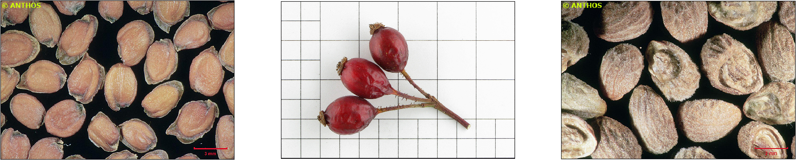

Citizen science has become a powerful force for scientific inquiry, providing researchers with access to a vast array of
data points while connecting non scientists to the real process of science. 
This citizen-researcher relationship creates a very interesting synergy, allowing for the creation, execution, and analysis
of research projects. With this in mind, a Convolutional Neural Network has been trained to identify seed images in 
collaboration with [Spanish Royal Botanical Garden](http://www.rjb.csic.es).

This Docker container contains a trained Convolutional Neural network optimized
for seed identification using images.
The architecture used is an Xception [3] network using Keras on top of Tensorflow.

As training dataset we have used a collection of images from the [Spanish Royal Botanical Garden](http://www.rjb.csic.es)
which consists of around 28K images from 743 species and 493 genera.

This service is based in the [Image Classification with Tensorflow](./deep-oc-image-classification-tensorflow.html) model.

**References**

[1]: Chollet, François. [Xception: Deep learning with depthwise separable convolutions](https://arxiv.org/abs/1610.02357)
arXiv preprint (2017): 1610-02357.
