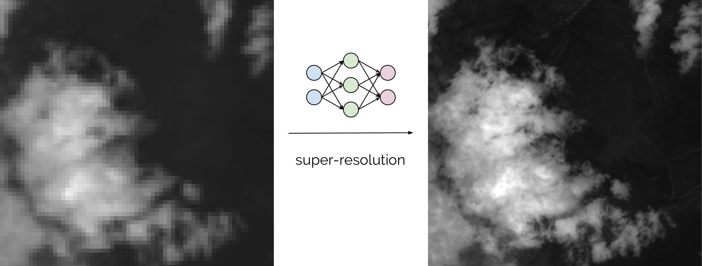

---

**This service is deprecated. Please refer to the [newer version](./deep-oc-satellite-super-resolution.html)**

---

With the latest missions launched by the European Space Agency (ESA), such as Sentinel, equipped with the latest technologies
in multi-spectral sensors, we face an unprecedented amount of data with spatial and temporal resolutions never reached before.
Exploring the potential of this data with state-of-the-art AI techniques like Deep Learning, could potentially change the
way we think about and protect our planet's resources.

This Docker container contains a trained Convolutional Neural network for super resolving low resolution bands
(20m and 60m) from the Sentinel 2 satellite to high resolution (10m) using Keras on top of Tensorflow, as described in [1].

**References**

[1]: Lanaras, C., Bioucas-Dias, J., Galliani, S., Baltsavias, E., & Schindler, K. (2018).
[Super-resolution of Sentinel-2 images: Learning a globally applicable deep neural network](https://arxiv.org/abs/1803.04271).
ISPRS Journal of Photogrammetry and Remote Sensing, 146, 305-319.
